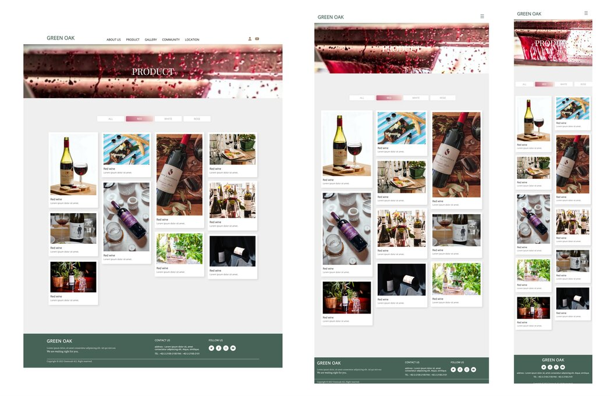
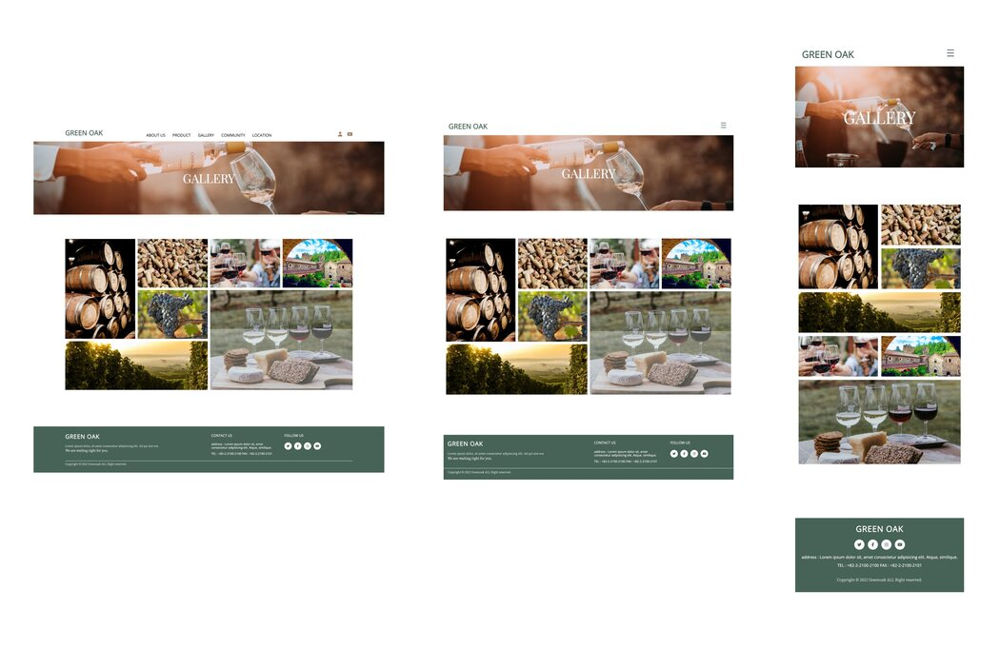
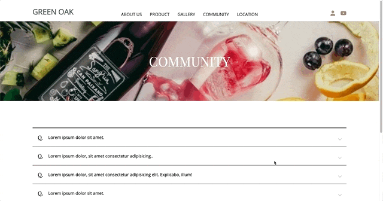

# GREEN OAK

|  |  |
| ------------------ | -------------------- |

[사이트 바로가기](https://greenoak-portfolio.netlify.app)

## 📋 Project

HTML, CSS, JS를 학습하며 제작한 반응형 웹사이트입니다.
기업형 홈페이지에서 주로 사용되는 소개, 게시판, 미디어(유튜브, 갤러리), 지도, 회원가입으로 구성되어 있습니다.

## ⚒️ 사용기술

- `HTML`, `CSS`, `JS`
- `Swiper`, `Isotope`
- `Youtube API`, `Kakaomap API`

## 📌 전체 기능 및 특징

- 반응형 웹 : 모든 환경에서 동일하게 이용할 수 있도록 반응형 레이아웃으로 제작
- API : Youtube, Kakamap API를 이용하여 미디어 호출
- 슬라이드 효과 : Swiper 사용
- 이미지 정렬 및 카테고리별 분류 : Isotope 사용

## 🗂️ 페이지별 기능 및 특징

HOME

- 스크롤 효과
- 동영상 자동 재생
- Swiper : auto slide, navigation, pagination
- Scroll to top button

ABOUT US

- hover 효과 : trasform, rotate, filter

PRODUCT

- Isotope.js : 이미지 자동 정렬 & 필터링
- 이미지 클릭시 풀스크린 팝업창이 생성된다.

GALLERY

- Grid 레이아웃 설정
- Hover 효과 : opacity, transition
- 이미지 클릭시 풀스크린 팝업창이 생성된다.

COMMUNITY

- 아코디언 효과

LOCATION

- Kakaomap API를 이용하여 지도 호출
- 지도 생성, 마커 적용

회원가입

- 회원가입 조건
  - ID : 5글자 이상
  - PASSWORD : 7글자 이상 (숫자, 영문자, 특수문자 포함)
  - PASSWORD 확인
  - EMAIL : 이메일 주소 형식을 충족해야 한다.
  - Check box
  - COMMENT : 20글자 이상
- 회원가입 조건에 맞지 않게 작성시 - 해당항목별로 에러메세지 생성
- 회원가입 조건에 올바르게 작성시 - 회원가입 성공 화면으로 전환

YOUTUBE

- Youtube API를 이용하여 미디어 호출
- Youtube에 만들어둔 playlist를 불러오고, 동영상 정보를 추출하여 title, thumbnail, description에 반영한다.
- 특정 영상 클릭시 iframe요소로 동영상을 재생한다.

